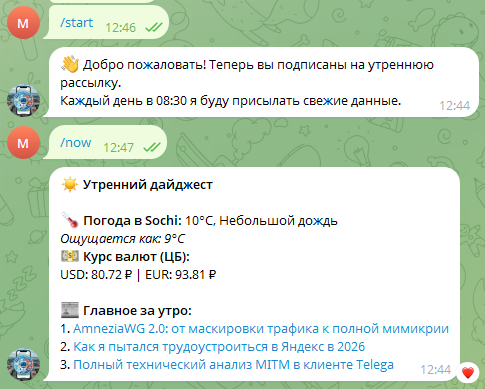

# ☀️ Morning Digest Telegram Bot

Это легкий и эффективный Telegram-бот на **Aiogram 3**, который автоматически собирает и присылает персонализированную утреннюю сводку: погоду, курсы валют и свежие новости.

---

## 📸 Как это выглядит

<p align="center">
  
  
</p>

---

## ✨ Основные возможности

* 🌡 **Умная погода:** Данные через *WeatherAPI* (температура, описание, «ощущается как»).
* 💵 **Финансовый монитор:** Актуальные курсы USD и EUR от ЦБ РФ.
* 📰 **Агрегатор новостей:** Последние заголовки из настраиваемых RSS-лент (РБК, Habr и др.).
* ⏰ **Автоматизация:** Ежедневная рассылка по расписанию через `APScheduler`.
* 👥 **Управление подпиской:** Пользователи могут сами подписываться (`/start`) и отписываться (`/stop`).
* 🗄 **Персистентность:** Хранение ID подписчиков в базе данных **SQLite**.

---

## 🛠 Стек технологий

* **Язык:** Python 3.9+
* **Фреймворк:** [Aiogram 3.x](https://github.com/aiogram/aiogram) (Асинхронность)
* **База данных:** SQLite
* **Планировщик:** APScheduler
* **Деплой:** Systemd & GitHub Actions (CI/CD)

---

## 🚀 Быстрый запуск

### 1. Клонирование репозитория
```bash
git clone https://github.com/maxfil777/daily-insight-bot.git
cd morning-digest-bot

---
2. Настройка окружения
Создайте виртуальное окружение и установите зависимости:

python3 -m venv venv
source venv/bin/activate
pip install -r requirements.txt

---
3. Конфигурация (.env)

Создайте файл .env в корне проекта и заполните его своими данными (пример):

BOT_TOKEN=123456789:ABCDEF...
WEATHER_KEY=your_api_key
MY_ID=12345678
CITY=Krasnodar
NOTIFY_TIME=08:30

---
📋 Команды бота

/start — Регистрация в базе и запуск ежедневной рассылки.
/now — Мгновенное получение текущей сводки.
/help — Справка по командам и текущие настройки.
/stop — Полная отписка и удаление из базы.
/admin_users — (Только для владельца) Просмотр списка ID всех подписчиков.

🏗 Деплой на VDS (Linux)

Для обеспечения непрерывной работы рекомендуется использовать systemd:

1. Создайте файл сервиса: sudo nano /etc/systemd/system/weather_bot.service
2. Скопируйте конфигурацию:


[Unit]
Description=Telegram Morning Bot
After=network.target

[Service]
User=debian
WorkingDirectory=/home/debian/weather_bot
ExecStart=/home/debian/weather_bot/venv/bin/python3 news_weather_bot.py
Restart=always
EnvironmentFile=/home/debian/weather_bot/.env

[Install]
WantedBy=multi-user.target

3. Запустите сервис:

sudo systemctl daemon-reload
sudo systemctl enable weather_bot
sudo systemctl start weather_bot

🔄 Автоматический деплой (CI/CD)

В проекте настроен GitHub Actions. При каждом git push в ветку main, код автоматически подтягивается на ваш сервер через SSH.
Настройка производится в файле .github/workflows/deploy.yml.

📝 Лицензия
Проект распространяется под лицензией MIT.
